## Dataset tooling — rebelHDF5

The training pipeline runs entirely on HDF5 files (Isaac Lab + MimicGen output).
Open-source MyHDF5 was a good starting point for raw inspection but didn't fit
robotics workflows, so we forked it into **rebelHDF5** and added the features
we actually needed to iterate on dataset quality.

Project link:
https://github.com/alex-luci/myhdf5/tree/pose-trace-integration

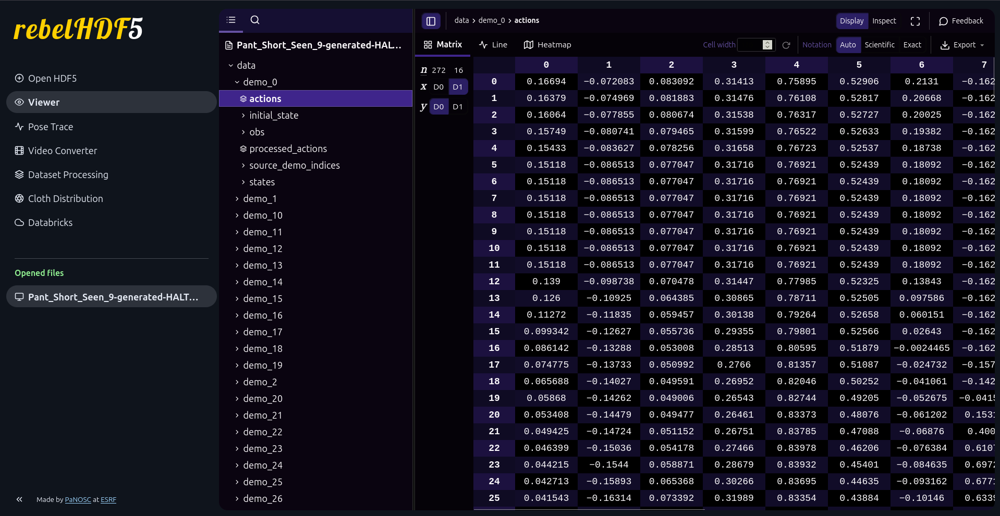

*Main view: opened-files panel on the far left, HDF5 group/demo tree, and a tabular view of the selected dataset (here, an `actions` array). The same chrome wraps every other tool below.*

- **Pose Trace.** A 3D viewer that renders the EEF trajectory as a continuous
  path alongside the garment keypoints over time, so failed grasps, drift, or
  misaligned trajectories are spotted at a glance instead of from raw arrays.
  A second tab plots the supporting metrics — EEF-to-keypoint distances,
  garment fold-form distances, and EEF-vs-keypoint heights over the episode.

  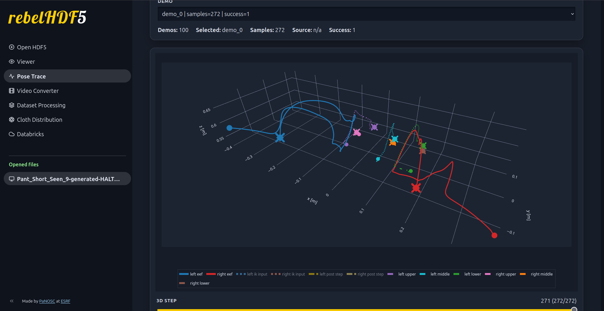

  *3D Pose Trace: left-arm (blue) and right-arm (red) EEF paths plotted with the six garment keypoints over time. The bottom slider scrubs through the episode step-by-step.*

  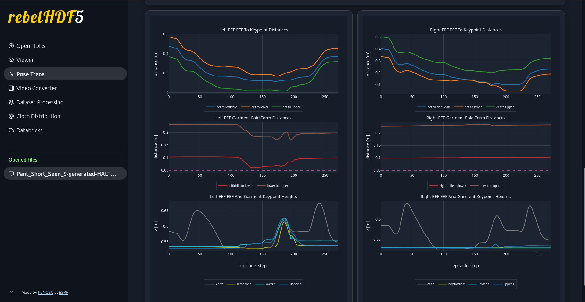

  *Pose Trace analytics tab: per-step EEF-to-keypoint distances (top), garment fold-form distances (middle), and EEF-vs-keypoint heights (bottom), broken out for the left and right arms.*

- **Video Converter.** Extracts the camera streams from an HDF5 episode and
  produces an MP4 directly in the browser — no external scripts, click-to-preview
  qualitative review of any sample.

  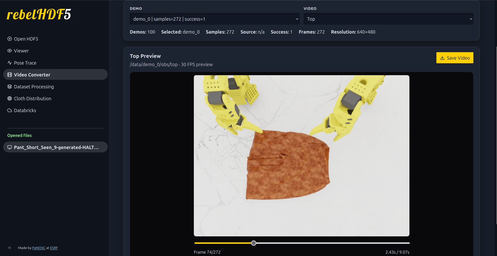

  *Video Converter: top-down camera stream extracted from the selected episode and played back inline at native FPS, with a Save Video button to export an MP4.*

- **Data Processing.** In-browser cut / merge / append operations on episodes,
  with key-level selection so you can keep only the parts of an episode you
  want. Bad rollouts get pruned, multiple generation runs are merged, new
  batches are appended — all without leaving the viewer.

  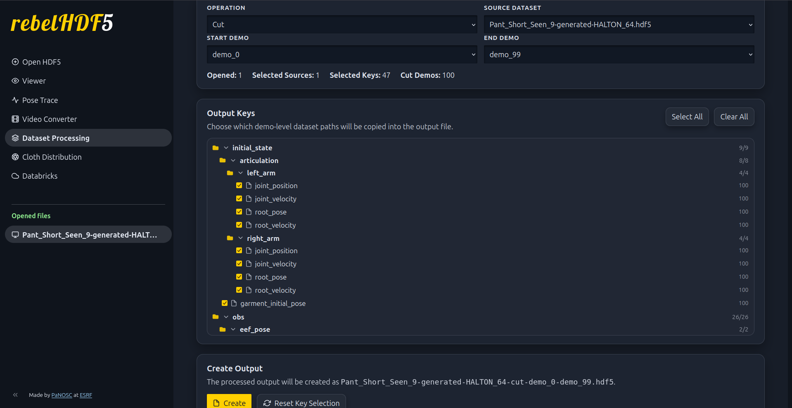

  *Data Processing: Cut operation across an episode range (`demo_0`–`demo_99`) with key-level selection — pick exactly which dataset paths (e.g. `initial_state/articulation/left_arm/joint_position`) survive into the output file.*

- **Cloth Distribution Analysis.** Scatter of init poses (success vs failed
  overlaid on the teleop set) plus failure-rate heatmaps over the (pos_x,
  pos_y) and (rot_x, rot_y) init space. This is what closes the loop with the
  Halton sampler — failure-prone regions become directly visible and can be
  re-sampled. Clicking any generated demo on the scatter draws an arrow back
  to the source teleop demo MimicGen pulled from, so failure clusters can be
  traced to specific source demonstrations.

  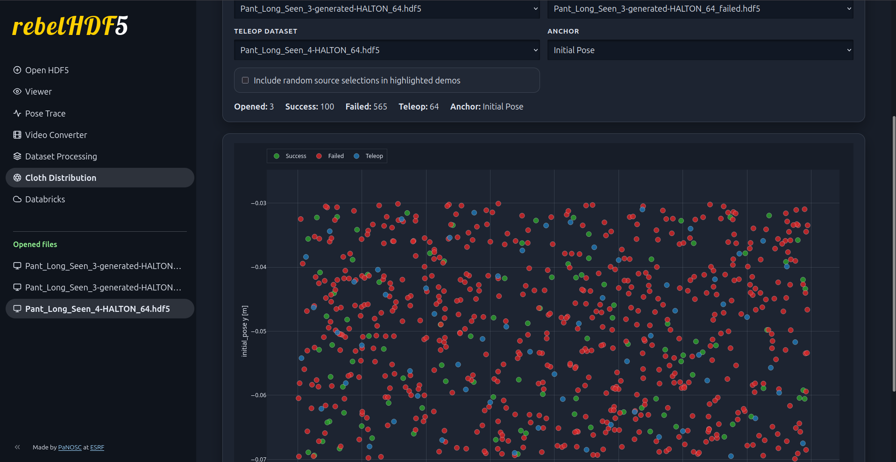

  *Init-pose scatter: every generated demo plotted on the (init_pose_x, init_pose_y) plane, color-coded as success (green), failed (red), or teleop source (blue), so coverage and failure clustering are visible at a glance.*

  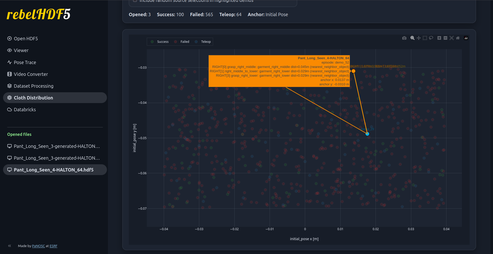

  *Click-to-trace: selecting a generated demo on the scatter draws arrows to the source teleop demo(s) MimicGen pulled from, with a tooltip listing the source path — so a failure cluster can be tied back to specific source demonstrations.*

  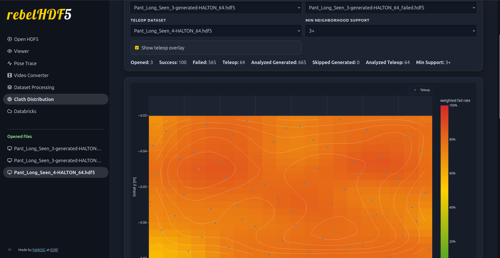

  *Failure-rate heatmap over the init-position space (pos_x, pos_y), aggregated from generated demos via nearest-neighbor pooling. Hotter cells = higher failure rate — directly drives where to oversample next.*

  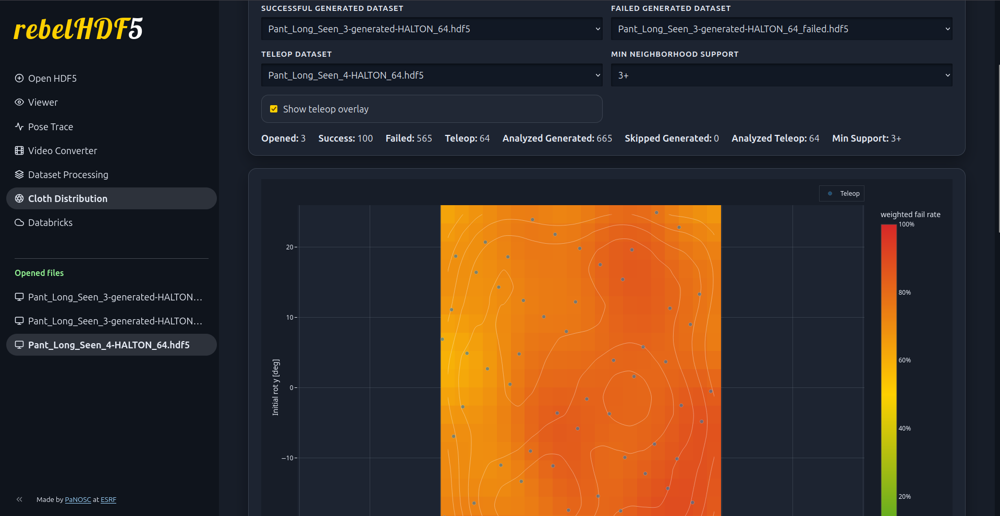

  *Same heatmap projection over the init-rotation space (rot_x, rot_y), exposing orientation regimes the policy struggles with independently of position.*

- **Databricks integration.** Single interface for uploading/downloading
  datasets, managing secrets, and triggering pipelines, so local iteration and
  cloud runs share one workflow.

  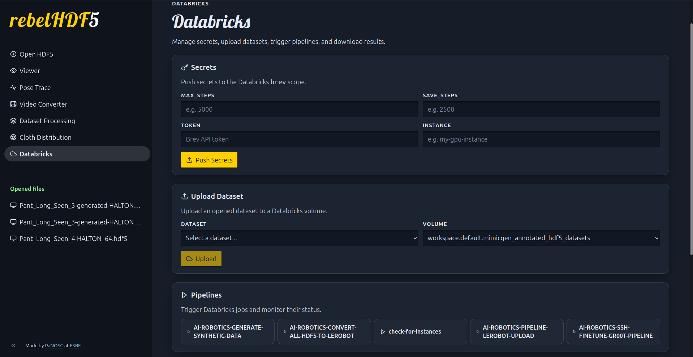

  *Screenshot 1 (Databricks page, top): the secrets and job-control section, where API tokens, the Databricks workspace URL, and rollout-step settings are pushed as scoped secrets; the same page also uploads the opened HDF5 file and triggers named jobs such as synthetic-data generation, HDF5→LeRobot conversion, and training.*

  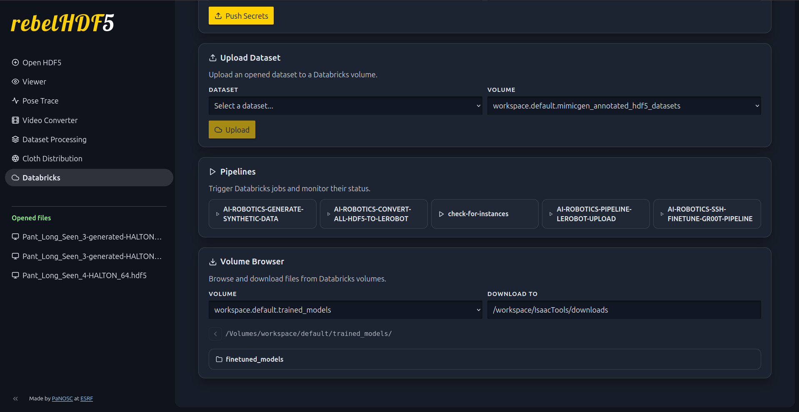

  *Screenshot 2 (Databricks page, bottom): the Volume Browser, which lets you inspect arbitrary Databricks volume paths such as `trained_models/` and pull selected files back to a configurable local download directory with one click.*

Net effect: HDF5s stopped being opaque archives and became interactive dataset
assets, which is what made the synthetic pipeline above tractable to debug at
scale.

## DATASET STRUCTURE

<pre class="tree">
data/# attrs: schema_version, fps, env_args, applied_action, num_episodes, total, description
├── demo_&lt;N&gt;/# attrs: num_samples, success, random_seed
│   ├── actions/
│   │   ├── pose# (T, A_pose) EEF pose + gripper actions; attrs: frame, format, quat_order, entity_order
│   │   └── joints# (T, total_joints) joint-space actions; attrs: units, joint_order, entity_order
│   │
│   ├── initial_state/
│   │   ├── articulation/
│   │   │   ├── articulation_name/
│   │   │   │   ├── joint_position# (1, J)
│   │   │   │   ├── joint_velocity# (1, J)
│   │   │   │   ├── root_pose# (1, 7)
│   │   │   │   └── root_velocity# (1, 6)
│   │   │
│   │   └── objects/
│   │       └── object_name/
│   │           ├── initial_pose
│   │           └── scale
│   │
│   ├── obs/# measured observations; attrs: sample_phase
│   │   ├── articulation/
│   │   │   └── articulation_name/
│   │   │       ├── joint_position# (T, J)
│   │   │       └── joint_velocity# (T, J)
│   │   │
│   │   ├── end_effectors/
│   │   │   └── end_effector_name/
│   │   │       └── pose# (T, 4, 4)
│   │   │
│   │   ├── objects/
│   │   │   └── object_name/
│   │   │       └── pose# (T, 4, 4)
│   │   │
│   │   ├── cameras/
│   │   │   └── camera_name# (T, H, W, C)
│   │   │
│   │   ├── sensors/
│   │   │   └── sensor_name/
│   │   │       └── field_name
│   │   │
│   │   └── datagen_info/# MimicGen-compatible; attrs: sample_phase, aligned_to
│   │       ├── eef_pose/
│   │       │   └── end_effector_name# (T, 4, 4)
│   │       ├── target_eef_pose/
│   │       │   └── end_effector_name# (T, 4, 4)
│   │       ├── object_pose/
│   │       │   └── object_name# (T, 4, 4)
│   │       └── subtask_term_signals/
│   │           └── signal_name# (T, 1)
│   │ 
│   └── reference_demo_indices/# (num_subtasks,) source demo index MimicGen selected for each subtask
│       └── articulation_name
</pre>
## Attribution

This project is based on work originally developed by the European Synchrotron Radiation Facility.

Original project:
- Copyright (c) 2022 European Synchrotron Radiation Facility
- Licensed under the MIT License

Modifications and extensions in this repository include additional features such as:
- Pose trajectory visualization
- HDF5 to video conversion tools
- Dataset processing utilities (merge, split, append)
- Cloth distribution analysis tools

All original code is used in accordance with the terms of the MIT License. A copy of the original license is included in this repository
